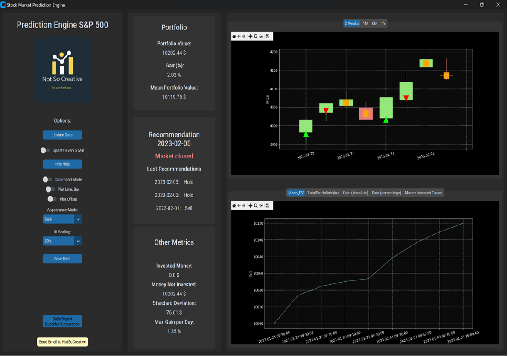

# NotSoCreative

Welcome to the NotSoCreative repository! This project is part of the Data Science II course offered by the Signal Processing Group at the Department of Electrical Engineering and Information Technology at TU Darmstadt.

  

## Objective

The main objective of this project is to develop a recommendation engine that optimizes an initial investment in the S&P 500 index. We've undertaken several approaches to achieve this goal:

1. **Technical Analysis Indicator Approach**: We began with an initial approach based on Technical Analysis Indicators.
   
2. **Random Forest Classifier and XGBoost Approach**: Next, we implemented a system based on Random Forest Classifier and XGBoost to further enhance our recommendation engine.

3. **LSTM and Bi-LSTM Approach**: Finally, we developed a strategy based on Long Short-Term Memory (LSTM) and Bidirectional LSTM (Bi-LSTM) models to explore time series data for improved predictions.

Throughout these approaches, we've conducted various tasks including data collection, data preparation, feature selection, hyperparameter optimization, and model comparison.

## Technology Stack

We've utilized a range of technologies to build and deploy our recommendation engine:

- **Python**: Leveraging libraries such as Keras, Scikit-learn, Pandas, and Plotly for data analysis, modeling, and visualization.
  
- **CustomTkinter**: We've used CustomTkinter for building the frontend interface to showcase the generated data.

- **Google Cloud Platform**: We migrated our running script to Google Cloud Platform, where we utilized a Debian VM and Google Storage for seamless deployment and storage.

- **Google Storage API**: We integrated the Google Storage API to manage and store data efficiently.

- **Jinja2**: Jinja2 was used for generating dynamic content in our web application.

- **SMTP**: For creating a daily digest email service to provide regular updates.

- **Batch and Shell Scripts**: We employed minimal batch (.bat) and shell (.sh) scripts for running the local script and scheduled tasks using Windows Task Scheduler and crontab, respectively.

By leveraging these technologies, we've developed a comprehensive recommendation engine that maximizes investment opportunities in the S&P 500 index.

Feel free to explore the code and documentation to gain insights into our approach and methodology. Additionally, you can check out our presentation slides [here](https://github.com/paulffm/S-P500-AI-Investement-Recommendation-Engine/blob/main/NotSoCreativePresentation.pdf). If you have any questions or suggestions, please don't hesitate to reach out!
